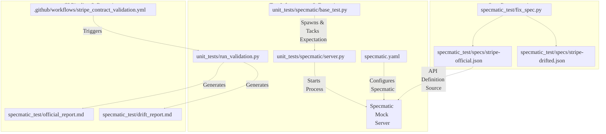

# Stripe Specmatic Contract Validation & Integration Testing

This document details the newly added files to this project to support **contract-driven integration testing** and **automated OpenAPI contract validation** using [Specmatic](https://specmatic.io/) for the Airbyte Stripe source connector.

---

## Why were these files added?

The Stripe connector originally relied on **HttpMocker** and static JSON stubs. This approach was prone to mock drift as the Stripe API evolved and did not validate HTTP requests/responses against the official OpenAPI specification. 

By introducing Specmatic, the codebase now:
1. Validates that outgoing client requests conform strictly to the Stripe OpenAPI contract.
2. Dynamically generates stubs that respond with valid schemas.
3. Automatically catches schema incompatibilities (contract drift) between the connector's internal data model and Stripe's specifications.

---

## File Structure & Functional Flow

Below is the structured breakdown of the newly added files, sorted by functional roles and how they connect with one another in the validation pipeline.

### 1. Specmatic Configurations and API Specifications
*   **[specmatic.yaml](file:///c:/Users/aryan/OneDrive/Documents/airbyte-master/specmatic.yaml)**
    *   **What it does:** Configures the Specmatic tool to look at the Stripe OpenAPI specifications, defining where they are stored and registering the local mock server.
    *   **Why it was added:** Required by the Specmatic executable to establish stubs, mocks, and validation configurations.
*   **[specmatic_test/specs/stripe-official.json](file:///c:/Users/aryan/OneDrive/Documents/airbyte-master/specmatic_test/specs/stripe-official.json)**
    *   **What it does:** Contains the preprocessed official Stripe OpenAPI specification, serving as the contract source of truth for the local Specmatic mock server during standard runs.
    *   **Why it was added:** Provides the API contract definition for validating request headers, paths, query parameters, and response formats.
*   **[specmatic_test/specs/stripe-drifted.json](file:///c:/Users/aryan/OneDrive/Documents/airbyte-master/specmatic_test/specs/stripe-drifted.json)**
    *   **What it does:** Contains a modified, intentionally "drifted" version of the Stripe spec.
    *   **Why it was added:** Serves as a reference target to prove that the validation runner and CI workflow successfully catch and report schema incompatibilities (e.g., changes in required fields or data types).

### 2. Pre-processing & Utility Scripts
*   **[specmatic_test/fix_spec.py](file:///c:/Users/aryan/OneDrive/Documents/airbyte-master/specmatic_test/fix_spec.py)**
    *   **What it does:** Modifies raw OpenAPI specs. It recursively prunes restrictive `required` lists (retaining only `id` and `object`), injects schemas for streams like `event` and `radar.early_fraud_warning`, flattens nested query parameters (e.g., `created[gte]`), duplicates array parameters into standard formats (like `type[]`), and maps clean, unique `operationId`s.
    *   **Why it was added:** The official Stripe OpenAPI spec is highly nested and contains strict parameters/schemas that cause parser failures under Specmatic. This pre-processing script patches and normalizes the specs so Specmatic can successfully mock all endpoints.

### 3. Test Infrastructure
*   **[airbyte-integrations/connectors/source-stripe/unit_tests/specmatic/__init__.py](file:///c:/Users/aryan/OneDrive/Documents/airbyte-master/airbyte-integrations/connectors/source-stripe/unit_tests/specmatic/__init__.py)**
    *   **What it does:** Python package initializer for the specmatic-related unit test files.
    *   **Why it was added:** Establishes the `specmatic` subdirectory as a structured Python module within integration tests.
*   **[airbyte-integrations/connectors/source-stripe/unit_tests/specmatic/server.py](file:///c:/Users/aryan/OneDrive/Documents/airbyte-master/airbyte-integrations/connectors/source-stripe/unit_tests/specmatic/server.py)**
    *   **What it does:** Manages starting and stopping the background `specmatic mock` server subprocess, redirects output to `specmatic_server.log`, handles waiting for the server to be listening, and contains cross-platform cleanup logic (such as calling Windows `taskkill` to recursively terminate Java child processes).
    *   **Why it was added:** Automates the lifecycle of the mock server so developers don't have to manually start and terminate it before and after running test suites.
*   **[airbyte-integrations/connectors/source-stripe/unit_tests/specmatic/base_test.py](file:///c:/Users/aryan/OneDrive/Documents/airbyte-master/airbyte-integrations/connectors/source-stripe/unit_tests/specmatic/base_test.py)**
    *   **What it does:** Declares [SpecmaticIntegrationTestCase](file:///c:/Users/aryan/OneDrive/Documents/airbyte-master/airbyte-integrations/connectors/source-stripe/unit_tests/specmatic/base_test.py#L16-L110), a pytest base class that automatically runs `SpecmaticServer` during test class setup/teardown. It also clears Python's `requests_cache` and deletes the SQLite cache file (`test_cache.sqlite`) between runs to prevent database connection locks, and supplies the [set_specmatic_expectation](file:///c:/Users/aryan/OneDrive/Documents/airbyte-master/airbyte-integrations/connectors/source-stripe/unit_tests/specmatic/base_test.py#L98-L110) helper.
    *   **Why it was added:** Standardizes the setup, caching, and stub expectations across all migrated integration test files.

### 4. Contract Validation Runner & CI/CD Workflows
*   **[airbyte-integrations/connectors/source-stripe/unit_tests/run_validation.py](file:///c:/Users/aryan/OneDrive/Documents/airbyte-master/airbyte-integrations/connectors/source-stripe/unit_tests/run_validation.py)**
    *   **What it does:** Invokes the Airbyte Stripe source connector to read streams against a live Specmatic Mock Server. It checks that outgoing client requests match the API specification, receives the output records, translates OpenAPI schema definitions to Draft-7 JSON schemas (adjusting `nullable` to standard JSON formats), runs validation using the `jsonschema` library, and outputs a markdown report.
    *   **Why it was added:** Acts as the executable harness for checking the compliance of the connector requests and response data against the OpenAPI contract.
*   **[.github/workflows/stripe_contract_validation.yml](file:///c:/Users/aryan/OneDrive/Documents/airbyte-master/.github/workflows/stripe_contract_validation.yml)**
    *   **What it does:** The GitHub Actions workflow file that runs on push/pull requests touching the Stripe connector. It starts the mock server, runs the validation runner against both the official spec and the drifted spec, and uploads the validation reports.
    *   **Why it was added:** Ensures continuous contract verification in the repository CI pipeline.

### 5. Documentation & Generated Reports
*   **[specmatic_test/README.md](file:///c:/Users/aryan/OneDrive/Documents/airbyte-master/specmatic_test/README.md)**
    *   **What it does:** Comprehensive manual outlining the integration architecture, requirements, stream migration status, and commands to execute both the integration tests and contract validation locally.
    *   **Why it was added:** Helps onboard developers and explains how the Specmatic integration functions.
*   **[specmatic_test/official_report.md](file:///c:/Users/aryan/OneDrive/Documents/airbyte-master/specmatic_test/official_report.md)**
    *   **What it does:** The report generated by [run_validation.py](file:///c:/Users/aryan/OneDrive/Documents/airbyte-master/airbyte-integrations/connectors/source-stripe/unit_tests/run_validation.py) after validating against the official Stripe OpenAPI specification.
    *   **Why it was added:** Persists the validation results of passing streams to show full compatibility.
*   **[specmatic_test/drift_report.md](file:///c:/Users/aryan/OneDrive/Documents/airbyte-master/specmatic_test/drift_report.md)**
    *   **What it does:** The report generated by [run_validation.py](file:///c:/Users/aryan/OneDrive/Documents/airbyte-master/airbyte-integrations/connectors/source-stripe/unit_tests/run_validation.py) after running validation against the drifted Stripe specification.
    *   **Why it was added:** Persists contract failure details, confirming that contract drift is correctly flagged.
